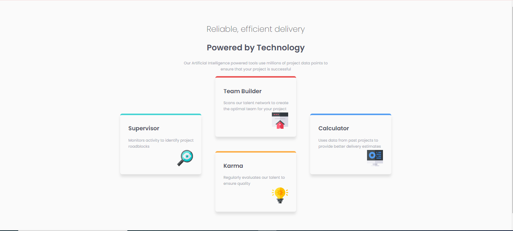
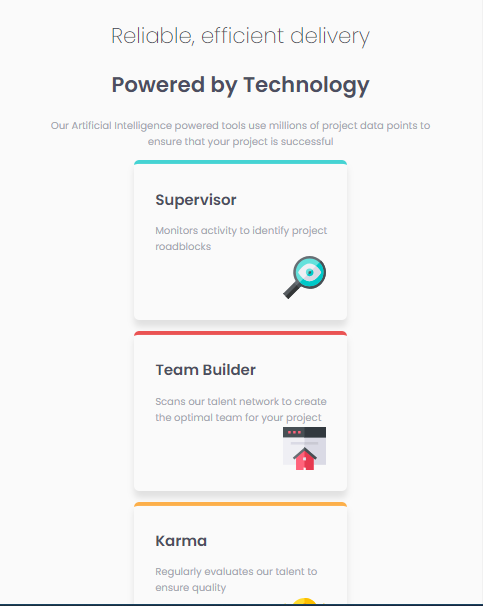

# Frontend Mentor - Four card feature section solution

This is a solution to the [Four card feature section challenge on Frontend Mentor](https://www.frontendmentor.io/challenges/four-card-feature-section-weK1eFYK).

## Table of contents

- [Overview](#overview)
  - [The challenge](#the-challenge)
  - [Screenshot](#screenshot)
  - [Links](#links)
- [My process](#my-process)
  - [Built with](#built-with)
  - [What I learned](#what-i-learned)
  - [Continued development](#continued-development)
- [Author](#author)

## Overview

### The challenge

Users should be able to:

- View the optimal layout for the site depending on their device's screen size

### Screenshot

### Links

- Solution URL: [Git hub repo link](https://github.com/KrishnaPoddar1/fourcardtemplate.git)
- Live Site URL: [Live site URL ]( https://krishnapoddar1.github.io/fourcardtemplate/)

## My process

### Built with

- Semantic HTML5 markup
- CSS custom properties
- Flexbox
- CSS Grid
- Mobile-first workflow
- Visual Studio Code

### What I learned

I learned the utilization of grid. Though I faced some chaleeneges initially I was able to solve them and learn a lot about grid.

### Continued development

More utilization of Grid and flex-box to elevate my skills

## Author

- Frontend Mentor - [@KrishnaPoddar1](https://www.frontendmentor.io/profile/KrishnaPoddar1)
